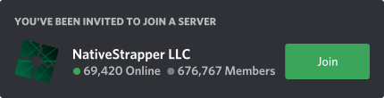

  
  

# NativeStrapper

> [!WARNING]
> Work in progress (WIP)!

NativeStrapper is currently under active development.

Join the Discord server to stay up to date:
  

---

**What is this?**

*NativeStrapper*
is a Roblox bootstrapper designed to run on any system capable of executing Roblox.

Unlike traditional bootstrappers like bloxstrap, appleblox, chevstrap and others, NativeStrapper gives you full control over the entire bootstrapping process by letting you write custom lua scripts (bootstrap scripts) that can completely manage Roblox updates and versioning, allowed settings and modifications, Roblox URIs and launch arguments, custom AppData paths (you can use multiple if you want), how Roblox is launched and configured, and so much more

This means you can use NativeStrapper with Roblox revivals, sober, android, a freaking 2007 roblox studio build, Minecraft (theoretically), ANYTHING.

**API Documentation:** soon!

## Contributing (PLEASE ARHGH):

Contributions are welcome.

Pull requests for fixes, improvements, and new features are accepted.

## Credits:

This project is built with inspiration and components from:

- Bloxstrap: primary inspiration (shocker)
- Lua: scripting language for bootstrap scripts
- json.hpp: fast C++ JSON parser
- Qt5: user interface framework